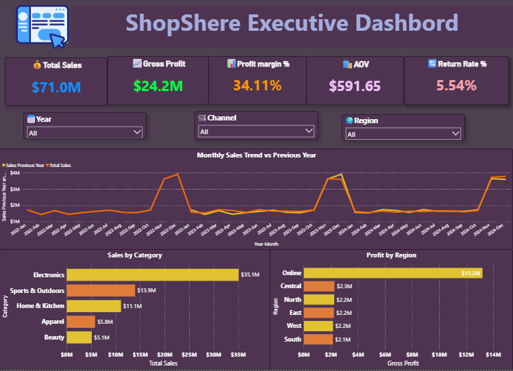
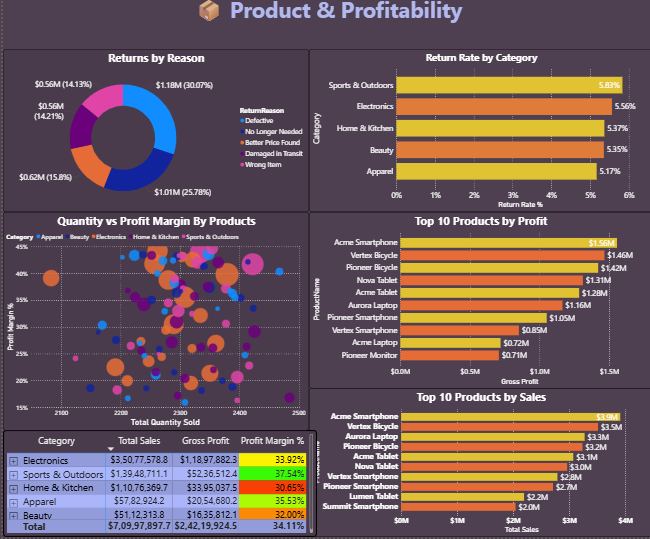
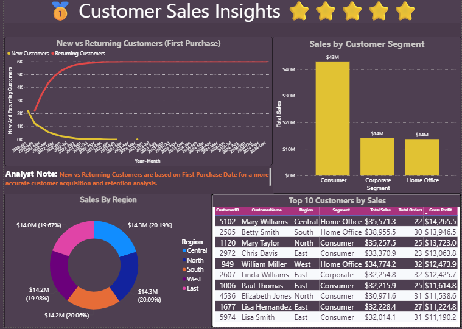
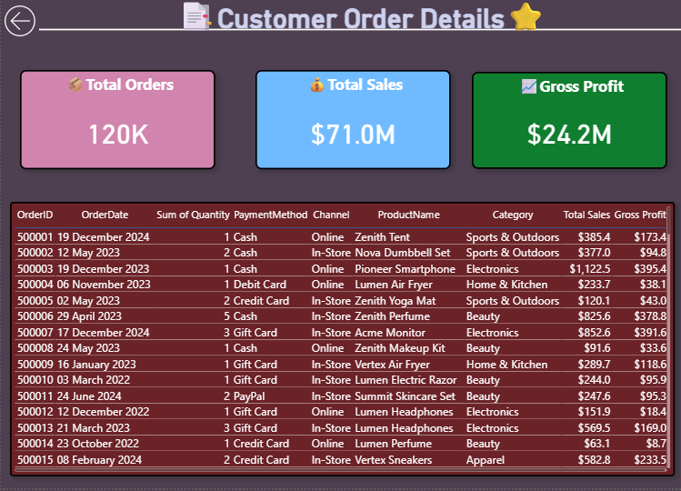

# 🛍️ ShopSphere Analytics Dashboard

A professional **Power BI Executive Dashboard** developed to analyze retail sales performance, product profitability, customer behavior, and order details. This dashboard enables business users to monitor KPIs, identify profitable products, analyze customer trends, and make data-driven decisions.

---

# 📌 Project Objectives

- Analyze overall business performance using key KPIs.
- Identify high-performing products and categories.
- Monitor customer acquisition and retention.
- Analyze return reasons and their business impact.
- Provide interactive dashboards for management decision-making.

---

# 🛠️ Tools & Technologies

- Microsoft Power BI
- DAX (Data Analysis Expressions)
- Power Query
- Data Modeling
- CSV Dataset

---

# 📊 Dashboard Pages

## 1️⃣ Executive Overview

Provides a high-level summary of business performance including:

- Total Sales
- Gross Profit
- Profit Margin %
- Average Order Value (AOV)
- Return Rate
- Monthly Sales Trend
- Sales by Category
- Profit by Region

> **Screenshot**

Replace this with your Page 1 screenshot.



---

## 2️⃣ Product & Profitability

Analyzes product performance and profitability.

Features:

- Top 10 Products by Sales
- Top 10 Products by Gross Profit
- Returns by Reason
- Return Rate by Category
- Product Profit Analysis

> **Screenshot**



---

## 3️⃣ Customer Insights

Provides customer behavior analysis including:

- New vs Returning Customers
- Sales by Customer Segment
- Sales by Region
- Top 10 Customers by Sales

**Note:** Customer acquisition is analyzed using **First Purchase Date** instead of JoinDate for better business accuracy.

> **Screenshot**



---

## 4️⃣ Customer Order Details

Detailed order-level information including:

- Total Orders
- Total Sales
- Gross Profit
- Interactive order table
- Drill-through functionality

> **Screenshot**



---

# 📈 Business Insights

- Electronics generated the highest overall profit.
- Central region contributed the highest gross profit.
- Sales showed positive year-over-year growth with noticeable seasonal peaks.
- Defective products were the primary reason for customer returns.
- First Purchase Date provides a more accurate analysis of new and returning customers than JoinDate.

---

# 💡 Recommendations

- Improve product quality to reduce return rates.
- Increase inventory before seasonal demand peaks.
- Focus marketing efforts on high-profit categories.
- Strengthen customer retention strategies.

---

# 📂 Repository Structure

```text
ShopSphere_Analytics_Muhammed_Ziyad
│
├── ShopSphere_Analytics_Muhammed_Ziyad.pbix
├── Insights_Report.pdf
├── README.md
└── screenshots/
    ├── page1.png
    ├── page2.png
    ├── page3.png
    └── page4.png
```

---

# 👨‍💻 Developed By

**Muhammed Ziyad**

Power BI | Data Analytics | SQL | Python | Data Visualization
